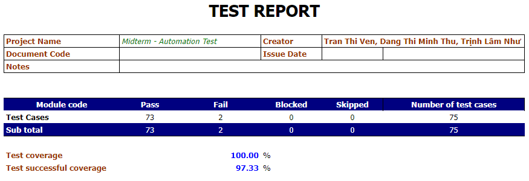
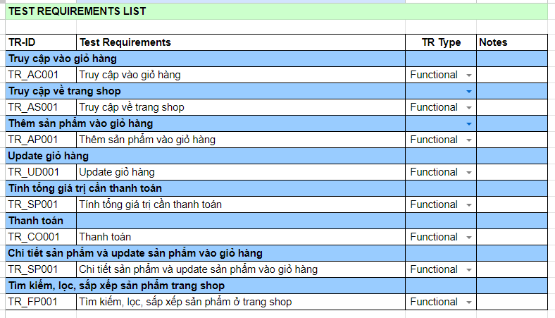

# THEMERC A PLATFORM BUILT FOR RANDOM DUMMY PRODUCTS
Web: https://dapper-pastelito-04ff24.netlify.app/

---
Testing a web application like THEMERC on the provided link can offer numerous learning opportunities and enhance your QA skills. Here are some key takeaways and learning outcomes from testing this platform:

Learning Outcomes from Testing THEMERC
1. Understanding Web Application Workflows:
- User Interactions: Gained insights into how users interact with the platform, including navigation, product searches, and form submissions.
- E-commerce Features: Learned about typical e-commerce functionalities such as product listings, shopping carts, and checkout processes.

2. Technical Skills Development:
- Robot Framework: Improved skills in using Robot Framework for test automation, including writing and running test cases.
- SeleniumLibrary: Enhanced ability to automate web browser interactions, such as clicking buttons, filling out forms, and verifying UI elements.
- VS Code: Gained proficiency in using VS Code for editing and debugging test scripts, as well as integrating with version control systems like Git.
3. Test Planning and Execution:
- Creating Test Plans: Learned to create detailed test plans that cover all functionalities of the web application.
- Writing Test Cases: Developed skills in writing comprehensive and effective test cases using the Robot Framework and its libraries.
4. Error Tracking and Debugging:
Identifying Issues: Improved ability to identify and document defects, including UI glitches, broken links, and functional errors.

## Tools used
### Tools: 
- Robot Framework: A generic test automation framework used for acceptance testing and acceptance test-driven development (ATDD).
- VS Code: A source-code editor made by Microsoft for Windows, Linux, and macOS. It includes support for debugging, embedded Git control, syntax highlighting, intelligent code completion, snippets, and code refactoring.
### Dashboard: 
- Excel: Used for creating and maintaining dashboards to track test results, metrics, and key performance indicators (KPIs).
### Libraries used 
> - SeleniumLibrary
> - BuiltIn
> - OperatingSystem
> - Collections
> - String
***
### Author
> TranTrucVy: 
<*https://github.com/TranTrucVy*>
